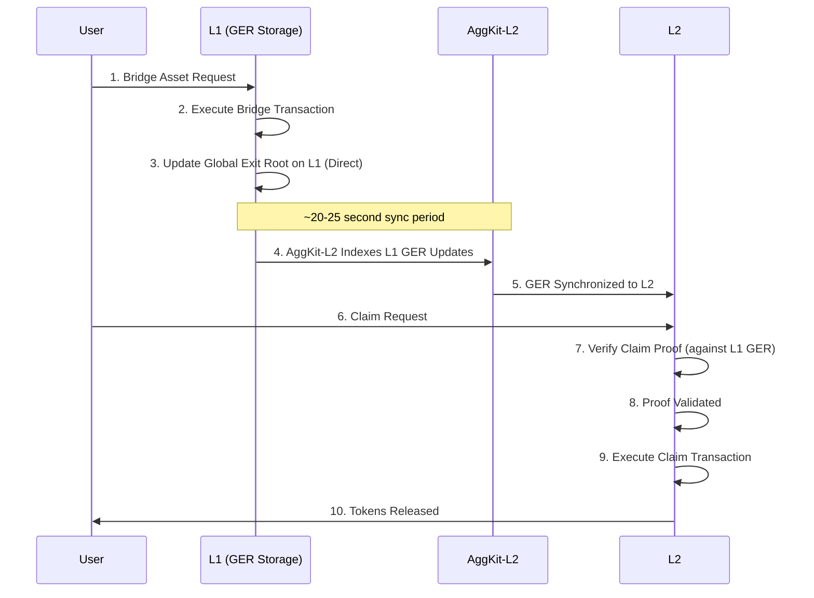
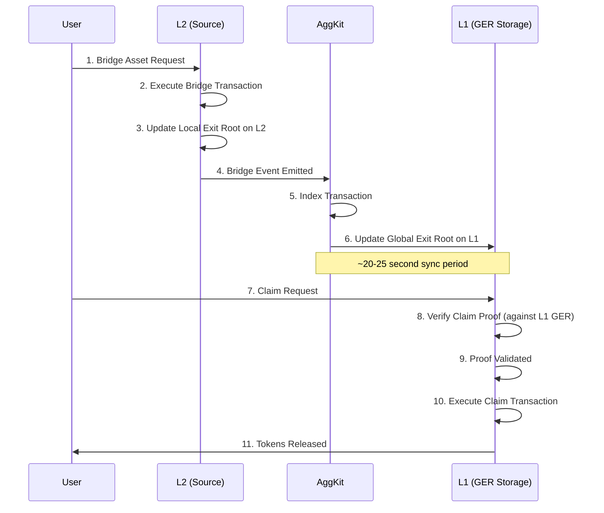
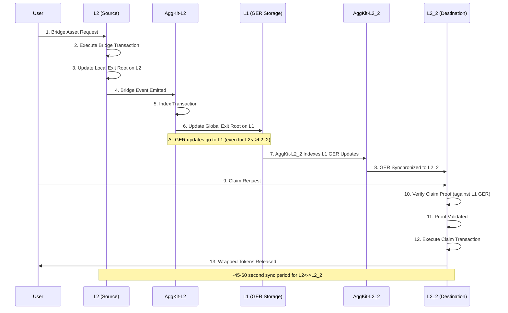

# Architecture Overview

## System Architecture

AggSandbox provides a complete local testing environment with multiple blockchain networks and bridge services, enabling developers to test and validate cross-chain operations in a controlled environment.

## Core Components

### **Network Layer**

#### **L1 - Ethereum Mainnet Simulation**

- **Purpose**: Source of truth for cross-chain operations
- **Technology**: Anvil (local Ethereum node)
- **Port**: 8545
- **Chain ID**: 1
- **Role**: Primary bridge coordination and finality

#### **L2 - Polygon zkEVM**

- **Purpose**: Primary L2 network for testing
- **Technology**: Anvil (zkEVM simulation)
- **Port**: 8546
- **Chain ID**: 1101
- **Role**: Primary L2 for L1<->L2 operations

#### **L3 - Additional Chain**

- **Purpose**: Additional network for multi-chain testing
- **Technology**: Anvil (Additional chain simulation)
- **Port**: 8547
- **Chain ID**: 137
- **Role**: L2<->L3 bridging and advanced scenarios (via L1)

### **Bridge Services**

The bridge infrastructure uses separate AggKit services for each L1<->L2 bridge pair, enabling independent operation and scaling.

#### **AggKit-L2 Service**

- **Purpose**: L2<->L1 communication and bridge coordination
- **Role**: Indexes L1 GER updates and syncs to L2; processes L2→L1 bridge events
- **Port**: 5577 (REST API), 8555 (RPC), 8080 (Telemetry)
- **Networks**: L1 (Chain ID 1) <-> L2 (Chain ID 1101)
- **Database**: `/app/data/aggkit_l2.db`

#### **AggKit-L3 Service** *(Multi-L2 mode only)*

- **Purpose**: L3<->L1 communication and bridge coordination
- **Role**: Indexes L1 GER updates and syncs to L3; processes L3→L1 bridge events
- **Port**: 5578 (REST API), 8556 (RPC), 8081 (Telemetry)
- **Networks**: L1 (Chain ID 1) <-> L3 (Chain ID 137)
- **Database**: `/app/data/aggkit_l3.db`

#### **Shared Responsibilities**

- Transaction validation
- Proof generation
- Cross-chain state coordination
- API endpoints for bridge data

#### **Global Exit Root (GER)**

- **Purpose**: Cross-chain state synchronization
- **Technology**: Merkle tree-based state coordination
- **Function**: Ensures consistent state across all networks
- **Updates**: Periodic synchronization of cross-chain state

#### **Bridge Contracts**

- **Unified Bridge Implementation**: Full production bridge contracts
- **Token Management**: ERC20 and wrapped token handling
- **Message Passing**: Cross-chain contract calls
- **Security**: Pessimistic proof validation

## Bridge Operation Flow

### **L1 → L2 Bridge Flow**

### **L2 → L1 Bridge Flow**

### **L2 → L2 Bridge Flow**

## Key Concepts

### **Pessimistic Proof System**

The Agglayer uses a **pessimistic proof approach** for cross-chain security:

- **Assumption**: All cross-chain operations are potentially invalid until proven
- **Validation**: Cryptographic proofs validate each cross-chain state transition
- **Security**: Prevents invalid state transitions and double-spending
- **Finality**: Operations are final only after proof validation

### **Global Exit Root (GER)**

The GER is a **Merkle tree root** that coordinates state across all networks:

- **Storage**: Always saved on L1, regardless of bridge origin (L1<->L2, L2<->L1, or L2<->L2)
- **L1 Communication**: Even L2<->L2 bridges communicate with L1 to update the root
- **Synchronization**: Root is updated on L1, then synced to destination L2 for claiming
- **Verification**: All claims require valid Merkle proofs against the L1-stored GER
- **Security**: L1 serves as the single source of truth for all cross-chain state

### **Bridge Types**

#### **Asset Bridges**

- **Function**: Transfer tokens between networks
- **Input**: Source token, amount, destination
- **Output**: Wrapped tokens on destination network
- **Use Case**: Token transfers, liquidity movement

#### **Message Bridges**

- **Function**: Execute contract calls across chains
- **Input**: Target contract, call data, optional ETH
- **Output**: Contract execution on destination
- **Use Case**: Cross-chain governance, protocol interactions

#### **Bridge-and-Call**

- **Function**: Atomic asset transfer + contract call
- **Input**: Tokens + contract call data
- **Output**: Tokens transferred + contract executed
- **Use Case**: DeFi integrations, complex workflows

## Performance Characteristics

### **Timing Expectations**

| Operation | Network Combination | Typical Time |
|-----------|-------------------|--------------|
| Bridge Transaction | Any → Any | ~5 seconds |
| AggKit Sync | L1 <-> L2 | ~30 seconds |
| AggKit Sync | L2 <-> L2 | ~60 seconds |L3
| Claim Transaction | Any | ~10 seconds |
| Full Bridge Flow | L1 <-> L2 | ~45 seconds |
| Full Bridge Flow | L2 <-> L2 | ~1 minute |

### **Scalability**

- **Concurrent Operations**: Multiple bridges can process simultaneously
- **Batch Processing**: AggKit processes multiple operations efficiently
- **Network Isolation**: Each network operates independently
- **Resource Management**: Docker-based resource allocation

### **Configuration**

- **Accounts**: 10 pre-funded accounts with known private keys
- **Contracts**: Pre-deployed bridge and token contracts
- **Networks**: Configured with proper chain IDs and bridge addresses
- **Services**: Health checks and dependency management

## Comparison with Production

### **Sandbox vs Production**

| Aspect | AggSandbox | Production Agglayer |
|--------|------------|-------------------|
| **Finality** | Instant (for testing) | Real network finality |
| **Timing** | Accelerated | Production timing |
| **Security** | Simulated | Full cryptographic security |
| **Scale** | Limited accounts | Unlimited accounts |
| **Cost** | Free | Real gas costs |
| **Reset** | Easy reset | Permanent state |

### **What Transfers to Production**

- **Bridge Logic**: Identical bridge contract behavior
- **API Patterns**: Same CLI commands and responses
- **Proof System**: Same cryptographic proof requirements
- **Error Handling**: Same error conditions and responses
