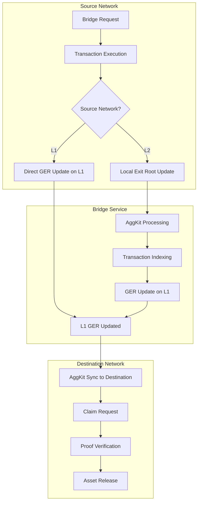
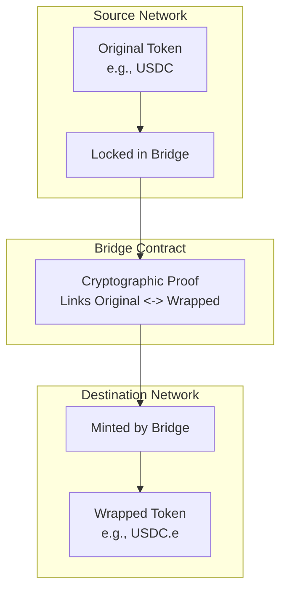

# Bridge Basics

**Fundamental concepts for understanding cross-chain bridge operations in the Agglayer ecosystem.**

## What is a Bridge?

A **bridge** is a protocol that enables the transfer of assets and data between different blockchain networks. In the Agglayer ecosystem, bridges use the **Unified Bridge** to provide secure, trustless cross-chain interoperability.

### Core Bridge Functions

1. **Asset Transfer**: Move tokens between networks
2. **Message Passing**: Execute contract calls across chains  
3. **State Synchronization**: Maintain consistent cross-chain state
4. **Security Validation**: Cryptographically verify all operations

## Bridge Types

### 🪙 **Asset Bridges**

Transfer tokens from one network to another.

**How it Works:**

1. **Lock**: Tokens are locked on the source network
2. **Exit Root Update**: 
    - **If L1 source**: Direct Global Exit Root update on L1
    - **If L2 source**: Local Exit Root update, then AggKit updates GER on L1
3. **Sync**: GER is synchronized to the destination network via AggKit
4. **Claim**: User claims the wrapped tokens on destination
5. **Mint**: Wrapped tokens are minted on destination network
6. **Verify**: Balance changes are verified

**Example:**
```bash
# Bridge 100 ERC20 tokens from L1 to L2
aggsandbox bridge asset \
  --network 0 \
  --destination-network 1 \
  --amount 100 \
  --token-address 0x5FbDB2315678afecb367f032d93F642f64180aa3
```

**Token Mapping:**

- **Original Token**: Lives on source network
- **Wrapped Token**: Represents original token on destination network
- **1:1 Backing**: Each wrapped token backed by locked original token

### **Message Bridges**

Execute contract calls across networks.

**How it Works:**

1. **Encode**: Message data is encoded for cross-chain transport
2. **Bridge**: Message is sent to bridge contract on source network
3. **Exit Root Update**:
    - **If L1 source**: Direct Global Exit Root update on L1
    - **If L2 source**: Local Exit Root update, then AggKit updates GER on L1
4. **Sync**: GER is synchronized to the destination network via AggKit
5. **Claim**: Message is claimed and executed on destination
6. **Verify**: Contract state changes are verified

**Example:**
```bash
# Bridge a message to call a contract on L2
aggsandbox bridge message \
  --network 0 \
  --destination-network 1 \
  --target 0xContractAddress \
  --data 0xEncodedCallData
```

**Use Cases:**

- Cross-chain governance votes
- Protocol parameter updates
- Cross-chain notifications
- State synchronization

### **Bridge-and-Call**

Atomic combination of asset transfer and contract execution.

**How it Works:**

1. **Bridge**: Assets are bridged on source network
2. **Exit Root Update**:
    - **If L1 source**: Direct Global Exit Root update on L1
    - **If L2 source**: Local Exit Root update, then AggKit updates GER on L1
3. **Sync**: GER is synchronized to the destination network via AggKit
4. **Claim Assets**: Asset bridge is claimed first
5. **Call Contract**: Contract is called with the bridged assets
6. **Execute**: Both operations succeed or both fail atomically
7. **Verify**: Both asset transfer and contract execution verified

**Example:**
```bash
# Bridge tokens and call a contract atomically
aggsandbox bridge bridge-and-call \
  --network 0 \
  --destination-network 1 \
  --token 0xTokenAddress \
  --amount 50 \
  --target 0xContractAddress \
  --data 0xCallData \
  --fallback 0xFallbackAddress
```

**Two-Phase Claiming:**

- **Phase 1**: Claim asset bridge (deposit_count = 0)
- **Phase 2**: Claim message bridge (deposit_count = 1)

## Network Combinations

### **Supported Bridge Paths**

| Source | Destination | Description | Sync Time |
|--------|-------------|-------------|-----------|
| **L1 → L2** | Ethereum → zkEVM | Primary bridge path | ~30 seconds |
| **L2 → L1** | zkEVM → Ethereum | Reverse bridge path | ~30 seconds |
| **L2 → L2** | zkEVM → Additional | Direct L2-L2 bridge | ~45-60 seconds |

### **Network IDs**

- **Network 0**: L1 (Ethereum)
- **Network 1**: L2-1 (Polygon zkEVM)
- **Network 2**: L2-2 (Additional Chain)

## Bridge Lifecycle

### 📋 **Complete Bridge Operation**



### **Timing Considerations**

#### **Why the Wait?**

- **Security**: Pessimistic proofs require validation time
- **Consensus**: Networks need time to reach finality
- **Synchronization**: Cross-chain state must be consistent
- **Proof Generation**: Cryptographic proofs take time to compute

#### **Timing Breakdown**

**For L1 → L2 Bridges:**

1. **Bridge Transaction**: ~5 seconds (network confirmation)
2. **Direct GER Update**: Immediate (L1 native)
3. **AggKit Sync to L2**: ~20-25 seconds (cross-chain state sync)
4. **Claim Transaction**: ~5 seconds (network confirmation)

**For L2 → L1/L2 Bridges:**

1. **Bridge Transaction**: ~5 seconds (network confirmation + local exit root update)
2. **AggKit Processing**: ~10-15 seconds (transaction indexing)
3. **GER Update on L1**: ~5-10 seconds (global exit root synchronization)
4. **AggKit Sync to Destination**: ~10-30 seconds (cross-chain state sync)
5. **Claim Transaction**: ~5 seconds (network confirmation)

## Token Mechanics

### **Token Wrapping**

When tokens are bridged, they undergo **wrapping**:



### **Token Address Discovery**

Use bridge utilities to discover token addresses:

```bash
# Find wrapped token address
aggsandbox bridge utils get-mapped \
  --network 1 \
  --origin-network 0 \
  --origin-token 0xOriginalToken

# Pre-calculate wrapped address
aggsandbox bridge utils precalculate \
  --network 1 \
  --origin-network 0 \
  --origin-token 0xOriginalToken

# Get origin token info
aggsandbox bridge utils get-origin \
  --network 1 \
  --wrapped-token 0xWrappedToken
```

## Security Fundamentals

### **Trust Model**

The Agglayer bridge operates on a **minimized trust model**:

- **Smart Contracts**: Audited, immutable bridge logic
- **Cryptographic Proofs**: Mathematical validation of operations
- **Pessimistic Approach**: Assume invalid until proven valid
- **Decentralized Validation**: Multiple validators confirm operations

### **Proof System**

Each bridge operation requires **cryptographic proof**:

1. **Local Exit Root**: Each network maintains its own exit root
2. **Rollup Exit Root**: Each L2s's LER is a leaf node of the rollup exit root on L1
3. **Global Exit Root**: L1 aggregates all local exit roots of L2 via rollup exit root and L1's local exit root into global state
4. **Merkle Proofs**: Prove inclusion in Global Exit Root stored on L1
5. **State Proofs**: Validate cross-chain state transitions
6. **Signature Verification**: Confirm transaction authenticity
7. **Replay Protection**: Prevent duplicate operations

### **Security Considerations**

- **Finality**: Wait for network finality before bridging
- **Proof Validation**: Always verify proofs before claiming
- **Rate Limiting**: Be aware of bridge rate limits
- **Error Handling**: Implement proper error recovery

## Common Patterns

### **Basic Asset Bridge**
```bash
# 1. Bridge assets
aggsandbox bridge asset --network 0 --destination-network 1 --amount 100 --token-address 0xToken

# 2. Monitor bridge
aggsandbox show bridges --network-id 0

# 3. Wait for GER sync (~30 seconds for L1<->L2, ~45-60 seconds for L2<->L2)

# 4. Claim assets  
aggsandbox bridge claim --network 1 --tx-hash 0xBridgeTx --source-network 0

# 5. Verify claim
aggsandbox show claims --network-id 1
```

### 🔗 **Bridge-and-Call Pattern**
```bash
# 1. Prepare call data
CALL_DATA=$(cast calldata "transfer(address,uint256)" 0xRecipient 100)

# 2. Execute bridge-and-call
aggsandbox bridge bridge-and-call \
  --network 0 --destination-network 1 \
  --token 0xToken --amount 100 \
  --target 0xContract --data $CALL_DATA \
  --fallback 0xFallback

# 3. Claim asset bridge (deposit_count = 0)
aggsandbox bridge claim --network 1 --tx-hash 0xTx --source-network 0 --deposit-count 0

# 4. Claim message bridge (deposit_count = 1)  
aggsandbox bridge claim --network 1 --tx-hash 0xTx --source-network 0 --deposit-count 1
```

## Error Handling

### 🚨 **Common Issues**

1. **Insufficient Balance**: Not enough tokens to bridge
2. **Invalid Token**: Token doesn't exist on source network
3. **Claim Too Early**: Attempting to claim before AggKit sync
4. **Already Claimed**: Attempting to claim twice
5. **Invalid Proof**: Cryptographic proof validation failed

### **Error Recovery**

```bash
# Check bridge status
aggsandbox show bridges --network-id 0

# Verify claim eligibility
aggsandbox bridge utils is-claimed --network 1 --index 42 --source-network 0

# Check service health
aggsandbox status

# View detailed logs
aggsandbox logs --follow
```
