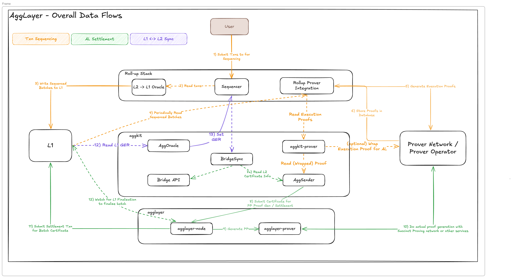

## Overview

**The Agglayer** is designed to provide an interoperability framework for cross-chain communication and state verification that is robust, scalable, and flexible enough to support these features between unalike blockchain networks. The key components of the Agglayer include the **Agglayer node**, the **pessimistic proof**, and the **unified bridge**. They are designed to enable lightweight, secure, and verifiable cross-chain transactions.

## Agglayer node

The **Agglayer Node** is a Rust-based service responsible for processing and verifying zero-knowledge (ZK) proofs from chains connected to the Agglayer. 

#### Key functions
- **Zero-knowledge proof verification**: The node receives and verifies cryptographic proofs from connected chains before sending them to L1.
- **Certificate management**: Handles certificates that attest to the state transitions of connected chains.
- **Orchestration of epochs**: Manages state updates in a structured manner through epochs.

## Pessimistic proof

The **pessimistic proof** mechanism ensures that any withdrawal claims made to the Agglayer are backed by legitimate deposits in the **Unified Bridge**. It uses a novel zero-knowledge proof system implemented in Rust, leveraging the **SP1 zkVM** and the **Plonky3 proving system**.

#### Key functions
- **Security validation**: Ensures that each chain connected to the Agglayer remains as secure as if it were operating independently.
- **State consistency**: Provides a complete view of all token and message transfers occurring across the Agglayer.
- **Fraud prevention**: Prevents chains from withdrawing more assets than they have legitimately received.

## Unified bridge

The **unified bridge** is responsible for maintaining the data structures related to chain states, cross-chain transactions, and the Agglayer’s Global Exit Root, ensuring cross-chain transactions are indeed finalized on the L1 before they can be claimed.  

#### Key functions
- **Cross-chain asset transfers**: Allows users to bridge assets between different chains.
- **Message passing**: Enables contract-to-contract interactions across chains.
- **State management and accounting**: Maintains Merkle proofs that ensure transactions are finalized before being processed on the destination chain.

## State transition proofs

The **state transition proof** system is Agglayer’s trust anchor, validating correctness at two complementary levels.

#### How it works
- **Internal validity proofs**  
  Each connected chain periodically emits a zero-knowledge proof (or another supported proof type) attesting that all state transitions in its latest block or epoch are valid. The Agglayer node verifies this proof and posts the resulting certificate to L1.
- **Cross-chain verification**  
  For operations that span multiple chains, Aggchain proofs together with the **pessimistic proof** confirm that token balances and message commitments match the records stored in the **unified bridge**.

#### Key functions
- **End-to-end security**: A transaction is finalized only when both its internal validity proof and its cross-chain proof are accepted.  
- **Atomic cross-chain execution**: Guarantees that assets and messages move between chains in a single, indivisible step.  
- **Modular extensibility**: New proof mechanisms (optimistic, fraud, etc.) can be integrated without altering Agglayer’s external interface.