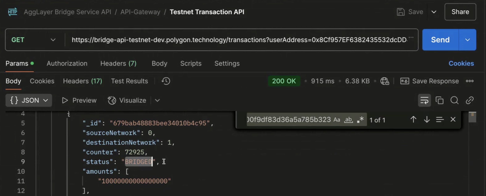
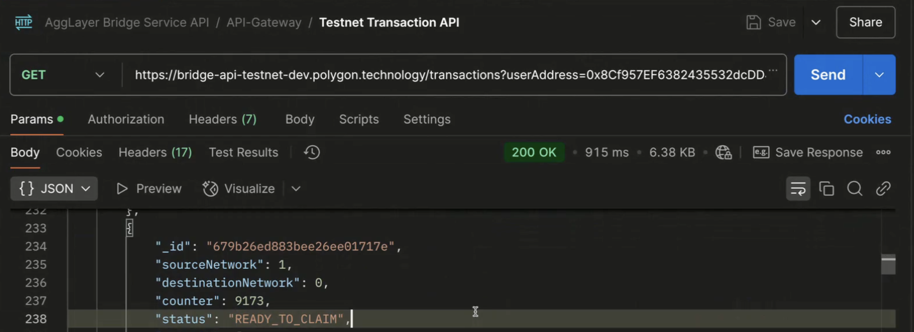

# Set up your environment for Agglayer

This guide will help you get familiar with LxLy.js, configure your code to interact with Agglayer chains, and bridge assets from the Ethereum Sepolia testnet to the Polygon zkEVM testnet using the Unified Bridge and lxly.js. <br><br>
In this guide you will: <br>
- Configure your environment <br>
- Bridge your asset <br>
- Check its status using the Bridge API <br>
- Use the claim API to claim the transaction on the destination chain.

## 📖 Table of Contents
- [Set up your Environment (Prerequisites)](#step-1-set-up-your-environment-prerequisites)
- [Configure Your Environment](#step-2-configure-your-environment)
  - [Update Your `config.js` File](#21-create-a-configjs-file)
  - [Set Up the Utility File: `utils_lxly.js`](#22-create-a-utility-file-utils_lxlyjs)
- [Bridge the Asset (`bridge_asset.js`)](#step-3-bridge-the-asset-bridge_assetjs)
- [Check Transaction Status via the Transaction API](#step-4-check-transaction-status-via-the-transaction-api)
- [Understand Transaction States](#step-5-understand-transaction-states)
- [Claim the Bridged Asset (`claim_asset.js`)](#step-6-claim-the-bridged-asset-claim_assetjs)
- [Confirm the Final Transaction Status](#step-7-confirm-the-final-transaction-status)


---
Refer to this repository for complete code - [Link](https://github.com/BrianSeong99/AggLayer_UnifiedBridge)
---
## Step 1: Set up your Environment (Prerequisites)

Before you begin, ensure that you have the following:

- **Node.js & npm:**
  - **Node.js:** v14.0.0 or later
  - **npm:** v6.0.0 or later
- **Crypto Wallet:**  
  A Crypto wallet (or similar) configured for testing.
- **Testnet ETH:**  
  Acquire test ETH (from a faucet) for the Sepolia testnet.

---

## Step 2: Configure Your Environment

### 2.1 Create a `config.js` File

Create a `config.js` with the correct network settings, RPC endpoints, bridge contract addresses, and account details. (See the [Template File](https://docs.agglayer.dev/agglayer/src/config.js) for a sample configuration). The reference `config.js` contains public RPCs as a placeholder, but it is recommended to get private RPCs for best results.

You should also have a `.env` file with private key details (be sure to add this to `.gitignore` so you do not commit a private key to Github). A template is [here](https://github.com/BrianSeong99/Agglayer_UnifiedBridge/blob/main/scripts/.env.example)

### 2.2 Create a Utility File: `utils_lxly.js`

This file initializes your connection with the Unified Bridge using lxly.js. It configures network providers (using HDWalletProvider or similar) for both the source and destination networks. Reference file - [utils_lxly.js](../src/utils/utils_lxly.js)

#### Example: `utils_lxly.js`
```javascript
const getLxLyClient = async (network = 'testnet') => {
  const lxLyClient = new LxLyClient();
  return await lxLyClient.init({
    log: true,
    network: network,
    providers: {
      // Source network: Sepolia Testnet (network ID: 0)
      0: {
        provider: new HDWalletProvider([config.user1.privateKey], config.configuration[0].rpc),
        configuration: {
          bridgeAddress: config.configuration[0].bridgeAddress,
          bridgeExtensionAddress: config.configuration[0].bridgeExtensionAddress,
          wrapperAddress: config.configuration[0].wrapperAddress,
          isEIP1559Supported: true
        },
        defaultConfig: {
          from: config.user1.address
        }
      },
      // Destination network: Polygon zkEVM (network ID: 1)
      1: {
        provider: new HDWalletProvider([config.user1.privateKey], config.configuration[1].rpc),
        configuration: {
          bridgeAddress: config.configuration[1].bridgeAddress,
          bridgeExtensionAddress: config.configuration[1].bridgeExtensionAddress,
          isEIP1559Supported: false
        },
        defaultConfig: {
          from: config.user1.address
        }
      },
    }
  });
}
```

## Step 3: Bridge the Asset (`bridge_asset.js`)

In this step, you will initiate a cross-chain asset transfer from the Sepolia testnet to zkEVM (Agglayer).

**What Happens:**
- **BRIDGED State:**  
  When you call the `bridgeAsset` API, the transaction is initiated on the source chain.

**Script Walkthrough: `bridge_asset.js`**
```javascript
const { getLxLyClient, tokens } = require('./utils/utils_lxly');
const config = require("./config");

const execute = async () => {
    // Initialize the lxly client
    const client = await getLxLyClient();

    // Define source network ID (Sepolia Testnet)
    const sourceNetworkId = 0;
    // Get the API for the Ether token on the source network
    const token = client.erc20(tokens[sourceNetworkId].ether, sourceNetworkId);

    // Define destination network ID (zkEVM / Agglayer)
    const destinationNetworkId = 1;
    // Bridge a specific amount of Ether (in wei)
    const result = await token.bridgeAsset("10000000000000000", config.user1.address, destinationNetworkId);

    // Log the transaction hash and receipt
    const txHash = await result.getTransactionHash();
    console.log("txHash", txHash);

    const receipt = await result.getReceipt();
    console.log("receipt", receipt);
}

execute()
  .then(() => {})
  .catch(err => {
    console.error("Error bridging asset:", err);
  })
  .finally(() => {
    process.exit(0);
  });
```
How to Run:
```bash
node bridge_asset.js
```


## Step 4: Check Transaction Status via the Transaction API

Before proceeding with claiming the asset, you need to verify its current status using the Transaction API. This step is typically performed using Postman or a cURL command.
Using Postman, import the API endpoint to check the status of your transaction. This query will return details such as the token bridged, the amount, and the current state of the transaction.
### Remember to get your API Key via this [link](https://polygontechnology.notion.site/Api-Gateway-Service-Documentation-13b80500116a80439ee3c34a850c416b)

### API Endpoints

- **Testnet:**
  ```bash
  https://api-gateway.polygon.technology/api/v3/transactions/testnet?userAddress={userAddress}
  ```
 - **Mainnet:**
    ```bash
    https://api-gateway.polygon.technology/api/v3/transactions/mainnet?userAddress={userAddress}
    ```
### Checking Transaction Status Using Postman




## Step 5: Understand Transaction States

After querying the Bridge API, you will receive information on the transaction states. The key states are:

| **Status**          | **Description** |
|---------------------|---------------------------------------------------------------|
| **BRIDGED**        | Transaction initiated on Sepolia via `bridgeAsset` API. |
| **READY_TO_CLAIM** | Asset available on zkEVM/AggLayer, awaiting claim. |
| **CLAIMED**        | Asset successfully claimed via `claimAsset` API. |

These states are verified by querying the API (for example, via Postman).

## Step 6: Claim the Bridged Asset (`claim_asset.js`)

Once the Bridge API shows that the asset is **READY_TO_CLAIM**, you can claim it on the destination chain using the claim API.




### What Happens:
- **CLAIMED State:**  
  The asset moves from a pending state to claimed after executing the claim.

### Script Walkthrough: `claim_asset.js`
```javascript
const { getLxLyClient, tokens } = require('./utils/utils_lxly');

const execute = async () => {
    // Replace with your actual bridge transaction hash from the bridge_asset.js output
    const bridgeTransactionHash = "0x1fc6858b20c75189a9fa8f3ae60c2a255cc3c41a058781f33daa57fc0f80b81a";
		
    // Initialize the lxly client
    const client = await getLxLyClient();
    
    // Define source network ID (Sepolia Testnet)
    const sourceNetworkId = 0;
    // Define destination network ID (zkEVM / Agglayer)
    const destinationNetworkId = 1;
    // Get the API for the Ether token on the destination network
    const token = client.erc20(tokens[destinationNetworkId].ether, destinationNetworkId);
    
    // Claim the bridged asset using the claimAsset API
    const result = await token.claimAsset(bridgeTransactionHash, sourceNetworkId, { returnTransaction: false });
    console.log("Claim result:", result);
    
    // Log the transaction hash and receipt for the claim transaction
    const txHash = await result.getTransactionHash();
    console.log("Claim txHash:", txHash);
    
    const receipt = await result.getReceipt();
    console.log("Claim receipt:", receipt);
}

execute()
  .then(() => {})
  .catch(err => {
    console.error("Error claiming asset:", err);
  });
```
How to run:
```bash
node claim_asset.js
```
> **_NOTE_**: `Normally developers won't have to worry about this, but if you're having trouble claiming, be sure to run this against the Claim API`

- **Claim API**: The merkle proof payload needed to process claims on the destination chain. 

    - API endpoint are:
    
        - Testnet: `https://api-gateway.polygon.technology/api/v3/proof/testnet/merkle-proof?networkId={sourceNetworkId}&depositCount={depositCount}`
        - Mainnet: `https://api-gateway.polygon.technology/api/v3/proof/mainnet/merkle-proof?networkId={sourceNetworkId}&depositCount={depositCount}`
    
    - `networkId` is the network ID registered on Agglayer, `0` for Ethereum/Sepolia, and `1` for Polygon zkEVM/Cardona, and more.
    
    - `depositCount` is the leaf index of the Local Exit Tree from the source chain(Explained in the next section). You can get the depositCount by checking the `bridgeAsset`/`bridgeMessage` event logs or use the Transaction API above to get the depositCount.

    - Remember to attach your API Key in header!

## Step 7: Confirm the Final Transaction Status

After claiming the asset, verify the final state using the Bridge API:
Use Postman or a curl command to ensure that the transaction state has been updated to **CLAIMED**.
